# Projeto 4

O objetivo desse projeto é desenvolver um programa para um CLP industrial de um processo de classificação e emabalagem de um produto. 

Iremos desenvolver o programa nas seguintes linguagens:

* ST

* Ladder

* FBD

* SFC

O objetivo de utilizar um ampla variedade de linguagens para resolver um mesmo problema é que além de podermos comparar qual linguagem conseguiu ser mais eficiente, também podemos praticar um grande variedade de linguagens utilizadas no mercado de automação industrial. 

### Requisitos do programa:

* Todo o processo de seleção e embalagem é iniciado e parado por um botão **B1**. Ao pressionar **B1** a primeira vez o processo inicia, o que é sinalizado por uma lâmpada **(L1)**. Se o processo estiver em funcionamento, pode ser parado pelo mesmo botão, o que é sinalizado por outra lâmpada **(L2)**.

* Classificação e seleção das peças - Uma peça cai no meio da esteira; após 3 segundos, para estabilizar a peça, os sensores S4 e S3 verificam a altura desta. Se a peça estiver boa, ela ativará os dois sensores. Se ela ativar apenas o sensor S3 a peça deverá ser considerada defeituosa e ser descartada.

* Os sensores S1 e S2, respectivamente, contabilizam as peças boas e defeituosas. A contagem das peças boas é usada para limitar o número de peças por caixa. Esse número máximo de peças por caixa é determinado por dois botões (B2 e B3). O número de peças defeituosas é contabilizado para controle de qualidade da produção. Também, se de dez peças, oito forem defeituosoas o processo deve ser interrompido e sinalizado por uma lâmpada (L3).

* Embalagem das peças - As peças boas, selecionadas pela parte descrita acima, são levadas pela esteira até a embalagem. O número máximo de peças por caixa, especificado pelos botões B2 e B3, e o sensor S1 são usados para controlar cada embalagem. Após cheia, a esteira é deslocada pelo acionamento do seu motor (M2), para que uma nova caixa receba as peças. O posicionamento correto da nova caixa é verificado pelo sensor S5.

O problema proposto pode ser visualizado abaixo:
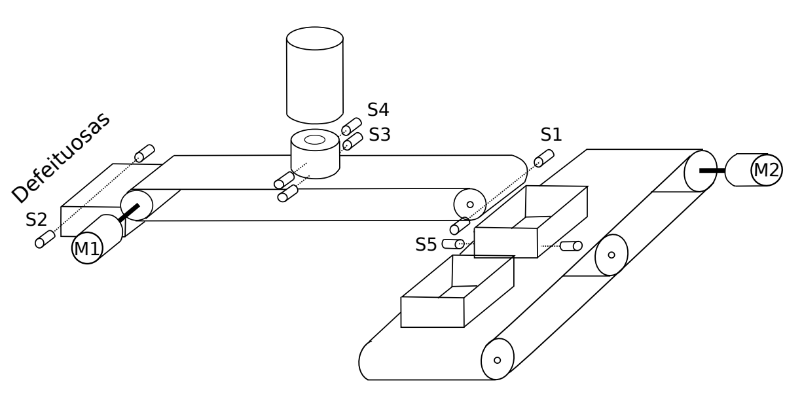

Com os requisitos analisados e identificado todos os componentes que serão usados. Iremos partir para programação. 

## ST

Começaremos com a linguagem ST. Como somos estudantes de engenharia de computação a linguagem de texto estruturado é melhor de compreender, pois se assemelha com algumas linguagens de programação.

Para a linguagem ST utilizaremos o programa CodeSys

Variáveis:

```sql
IF count_total > 10 THEN
    IF count_bad > 8 THEN
        l3 := TRUE;
        l1 := FALSE;
    END_IF
END_IF


IF b2 THEN
    max_bad := max_bad + 1;
    b2 := FALSE;
END_IF

IF b3 THEN
    max_good := max_good + 1;
    b3 := FALSE;
END_IF


IF b1 = TRUE THEN
    IF l1 = TRUE THEN
        l1 := FALSE;
        l2 := TRUE;
        b1 := FALSE;
        s5 := FALSE;
        new := FALSE;


        max_bad := 0;
        max_good := 0;

    ELSE
        l1 := TRUE;
        new := l1;
        l2 := FALSE;
        b1 := FALSE;
        l3 := FALSE;

        s1 := FALSE;
        s2 := FALSE;
        s3 := FALSE;
        s4 := FALSE;
        s5 := TRUE;

        count_total := 0;
        count_bad := 0;
        count_good := 0;

    END_IF
END_IF


IF NOT s2 AND NOT s1 AND NOT s3 AND NOT s4 AND l1 THEN
    new := TRUE;
END_IF

timer( IN := new, PT := T#3S);
curr_time := timer.ET;

on_sensor := timer.Q;

IF on_sensor THEN
    IF s4 AND s3 THEN
        m1_rigth := TRUE;
    ELSIF NOT s4 AND s3 THEN
        m1_left := TRUE;
    END_IF
END_IF


IF m1_rigth THEN
    IF s2 THEN 
        m1_rigth := FALSE;
        count_good := count_good + 1;
        count_total := count_total + 1;
        new := FALSE;
    END_IF
END_IF

IF max_good > 0 THEN
    IF count_good >= max_good THEN
        m2 := TRUE;
        s5 := FALSE;
        count_good := 0;
    END_IF;
END_IF

IF max_bad > 0 THEN
    IF count_bad >= max_bad THEN
        l3 := TRUE;
        l1 := FALSE;
    END_IF
END_IF


timer_m2(IN := m2, PT := T#3S);

IF m2 THEN
    s5 := timer_m2.Q;
END_IF;

IF s5 THEN
    m2 := FALSE;
END_IF


IF m1_left THEN
    IF s1 THEN 
        m1_left := FALSE;
        count_bad := count_bad + 1;
        count_total := count_total + 1;
        new := FALSE;
    END_IF
END_IF
```

Além do código, também criamos uma interface gráfica para testar nosso programa:

##### Testando o timer, o contador e a classificação de peça:

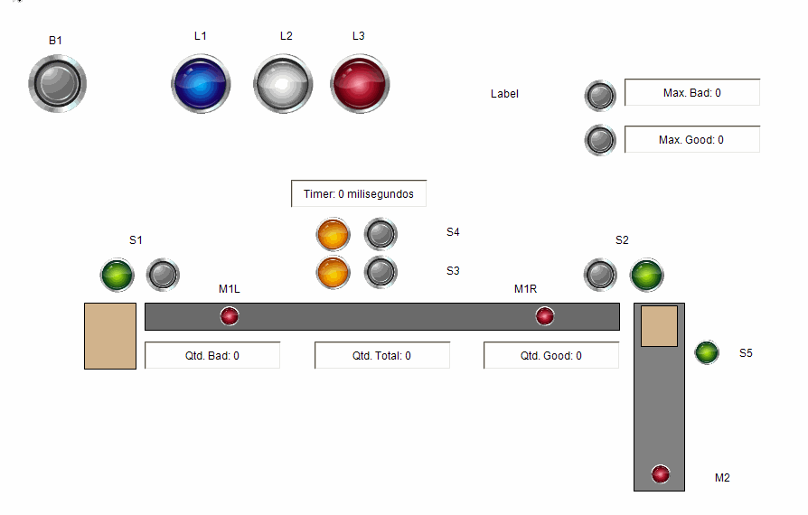

##### Testando a açao quando chega no limite de peças boas:

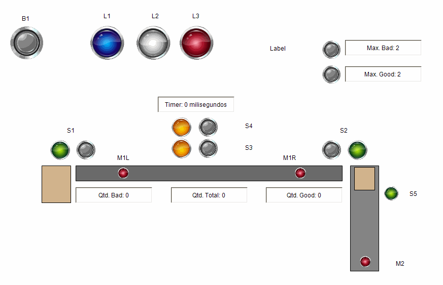

#### Testando a ação quando chega no limite de peças ruins:

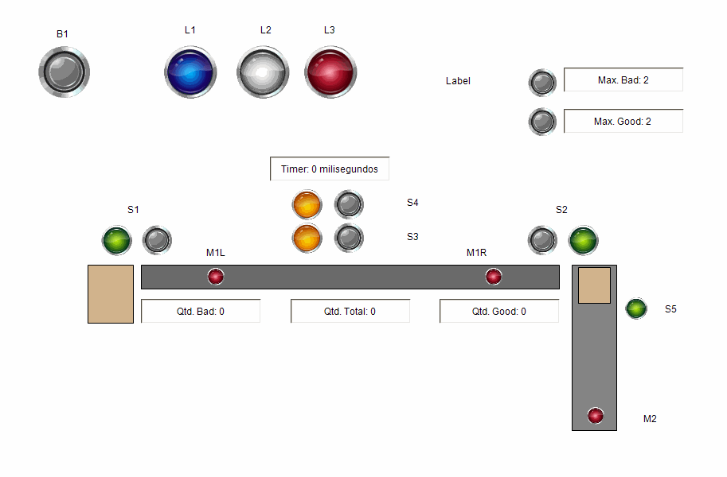

#### Testando a ação quando houve 10 itens sendo 2 bons e mais de 8 ruins:

Para esse problema eu coloquei um `IF` que verifica sempre se a quantidade de itens é maior que 10. Se sim, verifica se a quantidade de itens ruins foi maior que 8. Se sim, desliga o processo e acende a lâmpada `L3`.

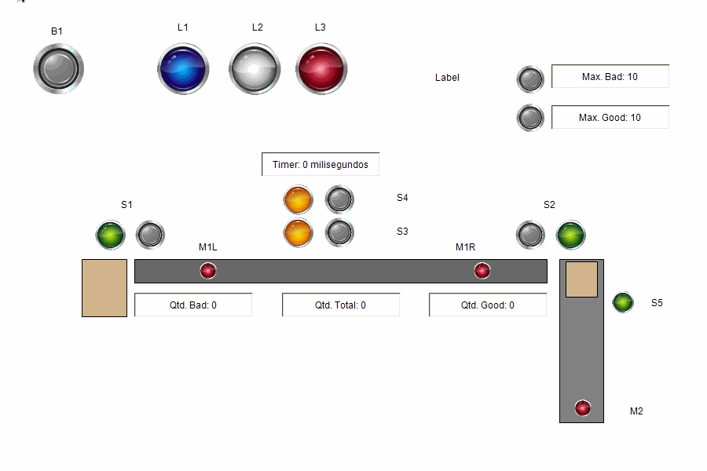

Por fim, foi concluído todos os requisitos necessários para o programa de CLP de embalagem e classificação utilizando a linguagem ST. Como nós temos uma maior familiaridade com linguagens de texto, foi relativamente mais facíl que utilizar as outras linguagens.

## Ladder

Para desenvolver o programa em Ladder, demos preferência por usar o CodeSys. Principalmente pela sua interface e declaração de variáveis.

Para criar um botão **B1** que serve tanto para iniciar o processo quanto para desligar o processo. Eu utilizei a variável `b1` que representa o botão físico ligado a um contato negado de `selo`. O `b1` da um `set` em `l1` e `selo` além de um reset em `l2` e `b1`. Isso significa que a próxima vez que o botão for pressionado, será ativado a network abaixo que contém um `b1` e um `selo` normalmente aberto. 

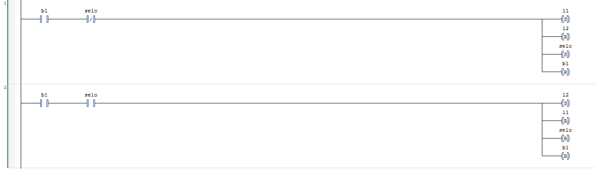

Variáveis usadas: 

```
PROGRAM PLC_PRG
VAR

    b1: BOOL;
    l1: BOOL;
    l2: BOOL;
    selo: BOOL;
    delay: BOOL;
    TON_0: TON;

    selo2: BOOL;
    on_sensor: BOOL;
    s3: BOOL;
    s4: BOOL;
    good: BOOL;
    bad: BOOL;
    s2: BOOL;
    m1_esq: BOOL;
    s1: BOOL;
    m1_dir: BOOL;

    r_s1: BOOL;
    CTU_0: CTU;
    good_count: BOOL;
    r_s2: BOOL;
    bad_count: BOOL;
    CTU_1: CTU;
    m2: BOOL;
    s5: BOOL;
    b2: BOOL;
    CTU_2: CTU;
    qtd_bad: int;
    b3: BOOL;
    reset: BOOL;
    qtd_good: INT;

    CTU_3: CTU;
END_VAR
```

Programa:

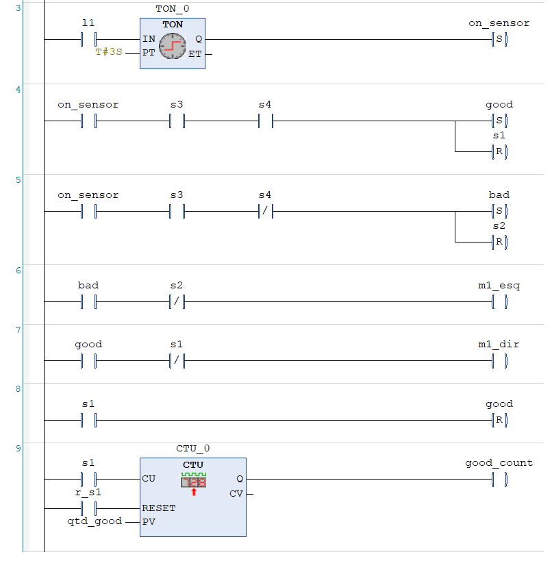
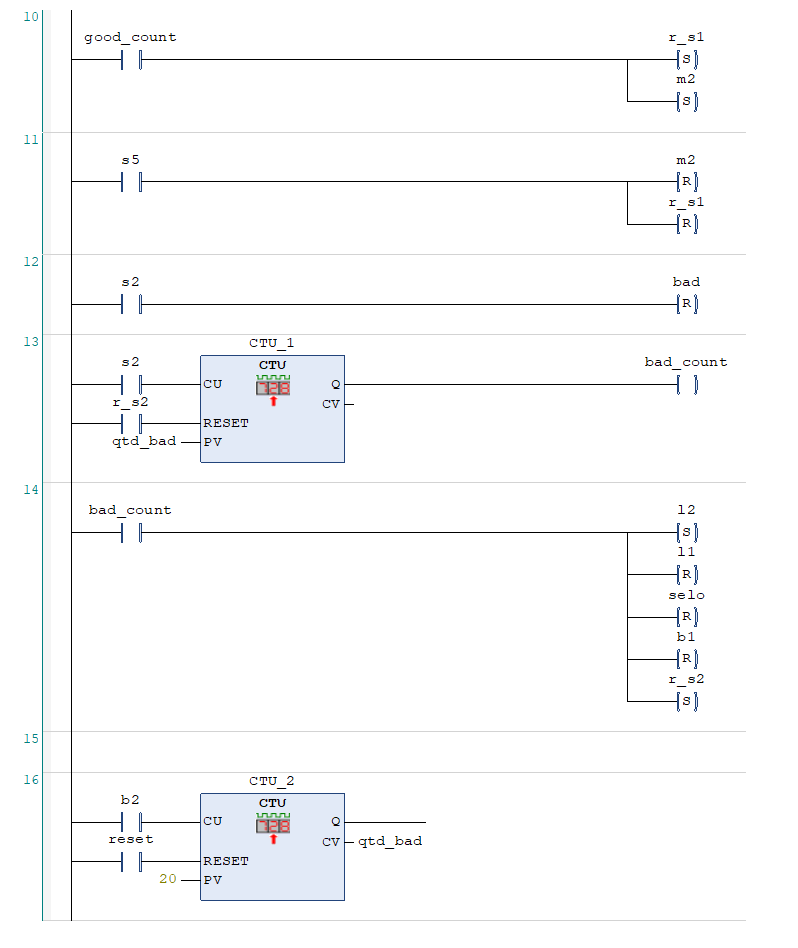
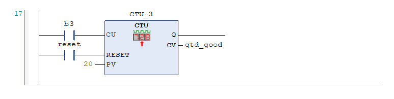

Rodando o projeto utlizando interface gráfica:

## FBD

Na linguagem FBD iremos utilizar o software ZelioSoft. Pessoalmente achamos melhor para a programaçao em linguagem FBD. Como o Zelio possui uma limitação em relação as variáveis, pois com ele não é possível declarar váriaveis do tipo inteiro. Não iremos implementar a funcionalidade de aumentar a quantidade de elementos por botão. 

#### Diagrama de programa

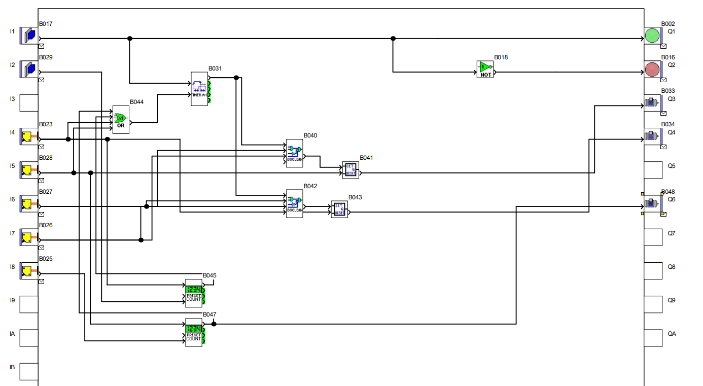

#### Entradas e saídas físicas

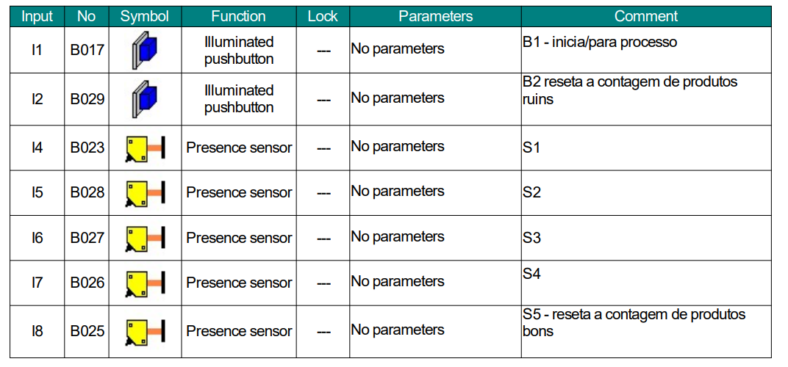
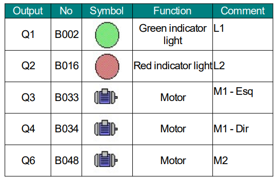

## SFC

Para a linguagem SFC iremos implementar usando o ZelioSoft.

#### Diagrama de programa

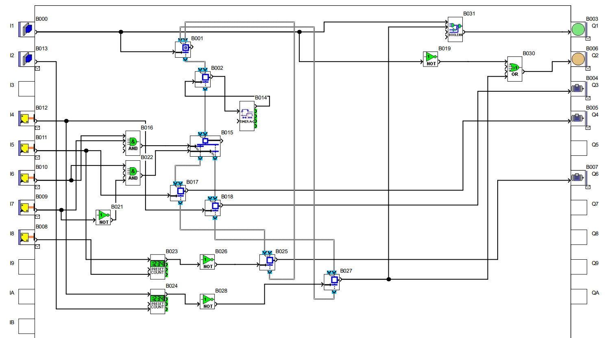

#### Entradas e saídas físicas

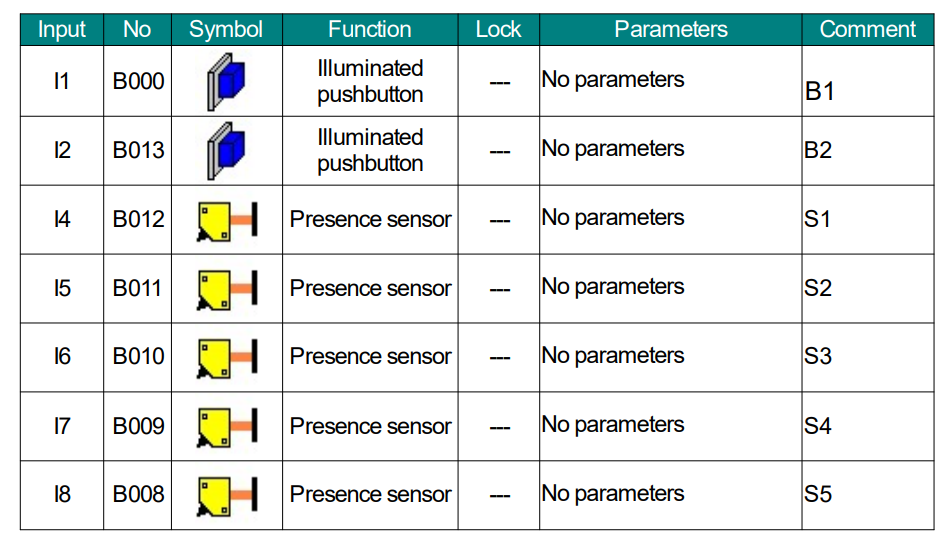
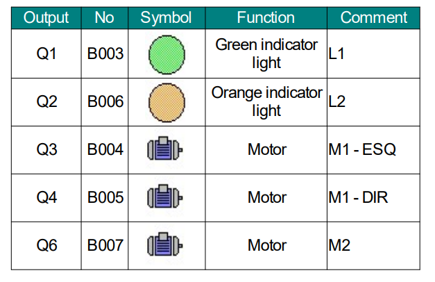

## Conclusão

O projeto de automação de classificação e embalagem usando CLP com os softwares Zelio e CodeSYS foi concluída com sucesso. A linguagem estruturada (ST) facilitou a programação, tornando-a mais acessível. A combinação de hardware e software atendeu com sucesso aos objetivos do projeto, proporcionando uma solução eficiente.
